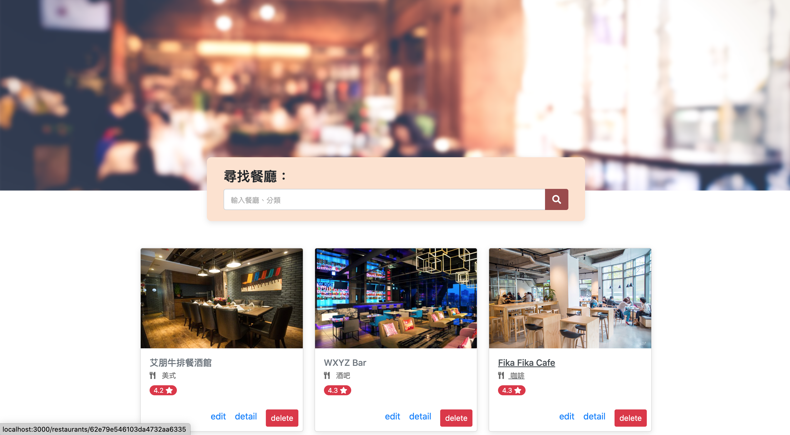

# Find-Restaurant

A restaurant Demo web application for users that can use this website to search all the foods  around the restaurant location of Demo website 
If you are interested in above please try it to discover which do you like !!!

## Features
- Users can see all restaurants and their information on the homepage
   * picture
   * name
   * category
   * rating
   
- Users can click any they interested trestaurant to view the more detailed information 
  * location
  * phone
  * description

### Create
- User can click button to create their interested restaurant

### Searching
- Type the title of the restaurants in Searc bar
- You can search restaurants by its English name or Chinese name or category of food contry

### Detail
- User can understand the restaurant detail after click the Detail link

### Edit 
- User can edit the restaurant infomation after click the Edit link

### Delete 
- User can delete whose not interested restaurant

### Technology
- JSON-API -> Listing restaurants by use 'JSON'(restaurant api) for seeds data
- template engine -> Using template engine to covert files from html-like to html for browser
- router -> Using http GET POST etc.. to do route
- MONGODB -> Using mongoose  help app.js  connect to database
